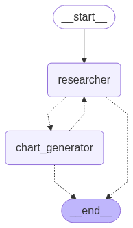

# langgraph-multiagent
Initial attempt to create a multi agent langgraph system

The below graph shows the interaction of the two agents

### Overall Purpose
The project implements a system where two specialized agents work together to research topics and generate charts based on that research. Think of it as a team where one member does the research and another creates visualizations.
### Key Components
1. **Two Specialized Agents:**
    - **Research Agent**:
        - Uses Tavily (a research/search tool) to gather information
        - Can only perform research tasks
        - Passes findings to the chart generator

    - **Chart Generator Agent**:
        - Uses a Python REPL tool to create charts and visualizations
        - Works with the data provided by the research agent
        - Can execute Python code to generate visualizations

2. **Workflow System:**
    - The agents work in an alternating pattern
    - They can pass work between each other

### Pre-Requisites

1. Run the command pip install -U langchain_community langchain_anthropic langchain_experimental matplotlib langgraph 

2. Have the following API Keys and parameters passed in from the .env file:
   ANTHROPIC_API_KEY=<ANTHROPIC API KEY>
   TAVILY_API_KEY=<TAVILY API KEY>
   LANGSMITH_TRACING=true
   LANGSMITH_ENDPOINT="https://api.smith.langchain.com"
   LANGSMITH_API_KEY=<LANGSMITH API KEY>
   LANGSMITH_PROJECT=langgraph-multiagent

